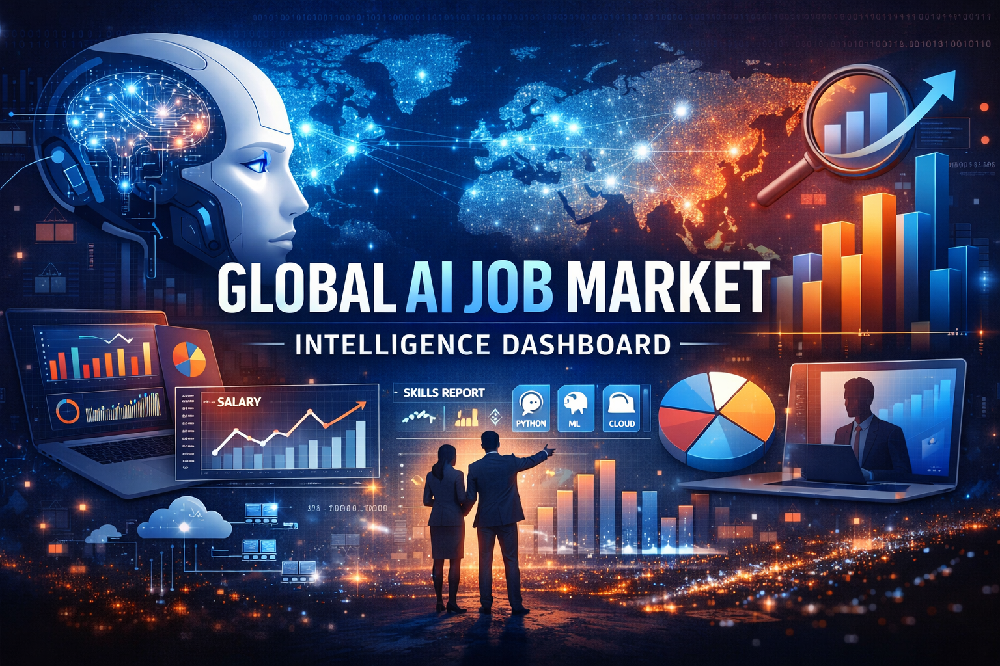
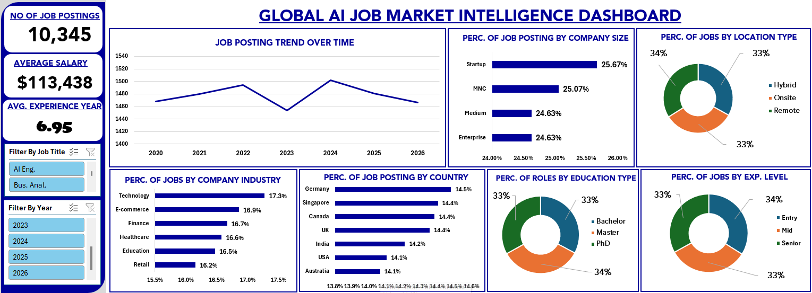

# A DATA-DRIVEN ANALYSIS OF THE GLOBAL DATA AI JOB MARKET 2020 - 2026

## INTRODUCTION

This project is one of the projects I completed as a volunteer data analytics tutor, alongside interns in the Data Analytics Track for the first cohort of the FadaQa Tech Scholarship Program.
FadaQa is a non-profit organization whose mission is to empower, educate, inspire, and foster a borderless tech community where young people can access the skills, opportunities, networks, and support they need to improve their standard of living, gain financial independence, and build innovative solutions, starting with Africa.
Note: The original purpose of this project was simply to guide the interns on how to use GitHub to upload their data analytics projects.

## ABOUT THE DATASET

The AI & Data Science Job Market Dataset (2020–2026) is a synthetically generated dataset designed to simulate real-world hiring patterns in the artificial intelligence and data science job market (see dataset).
The dataset contains structured information about job roles, company characteristics, required technical skills, education levels, experience requirements, and salary ranges. It reflects hiring trends across multiple countries, industries, and company sizes.To see the dataset [Click here](https://www.kaggle.com/datasets/shree0910/ai-and-data-science-job-market-dataset-20202026)

## PROBLEM STATEMENT
The data science field is one that continues to evolve rapidly as the years progress. In the age of artificial intelligence, there have also been significant shifts in the status quo.
This project seeks to explore the changing trends and patterns currently shaping the field, including areas such as salary across job titles, years of experience required, education level, and work location type (remote, onsite, or hybrid), among others.

## VISUALISATION

Microsoft Excel was used to design and develop this interactive dashboard for analyzing trends in the global AI and data science job market.

## INSIGHTS

1. **Average Salary by Job Title**: Below is the average salary for the job titles posted over the 7-year period:
  - Data Analyst — $99,136 
  - Data Scientist — $99,646 
  - Data Engineer — $99,741 
  - Business Analyst — $101,642 
  - Machine Learning Engineer - $139,705 
  - AI Engineer - $139,945 
These figures are arranged in ascending order.

2. **Total Number of Job Postings**: The total number of jobs posted from 2020 to 2026 is 10,345.
   
3. **Lowest and Highest Job Posting Years**: The years with the lowest and highest number of job postings were 2023 and 2024, respectively.
  - 2023 - 1,452 job postings 
  - 2024 - 1,502 job postings
    
4. **Variation in Education, Work Location, and Experience Level**: Across the different job titles and years, there were variations in:
  - Education level (Bachelor’s, Master’s, PhD) 
  - Work location type (Remote, Onsite, Hybrid) 
  - Experience level (Entry, Mid, Senior) 
However, the differences observed were not particularly significant. One possible explanation is that the dataset is synthetically generated, which may reduce the extent of real-world variation.

5. **Countries Posting Data Analyst Roles**: Over the years, Data Analyst roles were posted across several countries, including:
 - United Kingdom 
 - Canada 
 - Singapore 
 - United States 
 - Germany
   
6. **Industry Demand for Data Professionals**: Over the years, job postings came from various company categories and industries, showing that data professionals are increasingly in demand across multiple sectors. These industries include:
 - Finance 
 - Retail 
 - Healthcare 
 - Education 
 - Technology 
 - E-commerce 
This suggests that the demand for data and AI talent is broad and cross-industry, rather than being limited to only tech-focused companies.

## RECOMMENDATION FOR FURTHER ANALYSIS
The following recommendations highlight additional analyses that could be carried out using this dataset, as well as areas where the dataset could be expanded to generate deeper insights.

1. **Expand the Range of Job Titles**: It is well known that the data science field includes a wide range of job titles. However, this dataset focuses on only six (6) roles. Future analysis could explore emerging and specialized job roles that are becoming more prominent in the AI and data science space.
This would help provide a broader understanding of how the field is evolving and what new career opportunities are being created.

2. **Include Data on AI’s Impact on Human Roles**: Additional data that captures how artificial intelligence is transforming or automating human tasks would be valuable. This could help provide insights into the extent to which AI is replacing certain responsibilities, while also showing where human expertise remains essential in the workflow.
Such an analysis would offer a more balanced view of the relationship between AI and the future of work.

3. **Explore Emerging Tools and Technologies**: It is also important to identify the new tools and technologies gaining relevance in the field. While this dataset includes some core technical skills, future analysis could incorporate tools such as Alteryx, Julia, and other evolving technologies.
This would help reveal how different industries are adopting modern tools and technologies to remain competitive in the AI and data science landscape.

## CONCLUSION

Working on this project was truly worthwhile, as it provided valuable insight into the evolving landscape of the AI and data science job market. Given the vast amount of data being generated across different industries and fields, it is increasingly important to understand how artificial intelligence can complement traditional methods by improving efficiency and helping tasks be completed in less time.

To conclude, the following reflections are worth noting:
1. There is a need to understand the era we currently live in, especially as technology continues to shape the future of work.
2. One should never become complacent, but instead remain committed to continuous learning and developing proficiency in cutting-edge tools and technologies.
3. Connecting with leaders and professionals in the data science industry can provide broader perspective, deeper insight, and valuable career guidance.
4. Artificial intelligence should not be viewed solely as a threat, but as a companion and tool to be leveraged effectively.

